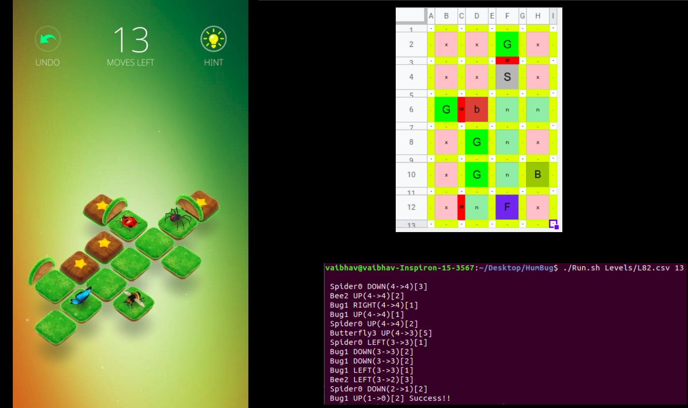

# Automated HumBug Android game
This script removes the hard time of finding tricky Humbug puzzle solution.

Play Store Game link: https://play.google.com/store/apps/details?id=com.dunderbit.humbug&hl=en_IN&gl=US

Use this script to find the correct sequence of moves. It handles all creatures.





### Use this sheet for Creating Levels
https://docs.google.com/spreadsheets/d/1k5-P5K4_T0rbiPzMC36hznz3ICWe6MjUcP5seNgBbi8/edit?usp=sharing

### How to Use
```
./Runs.sh <Level_file> <Number_of_moves>
```
